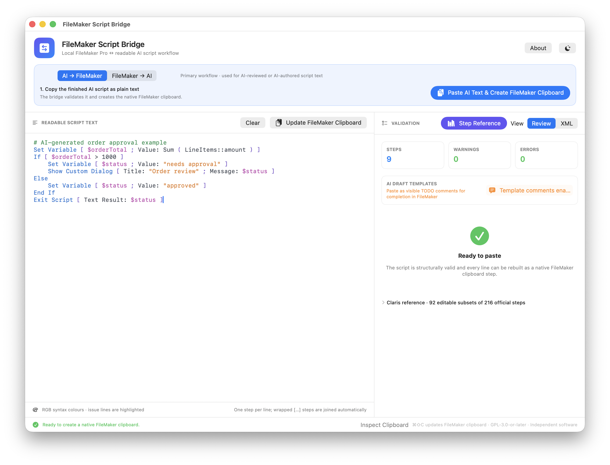
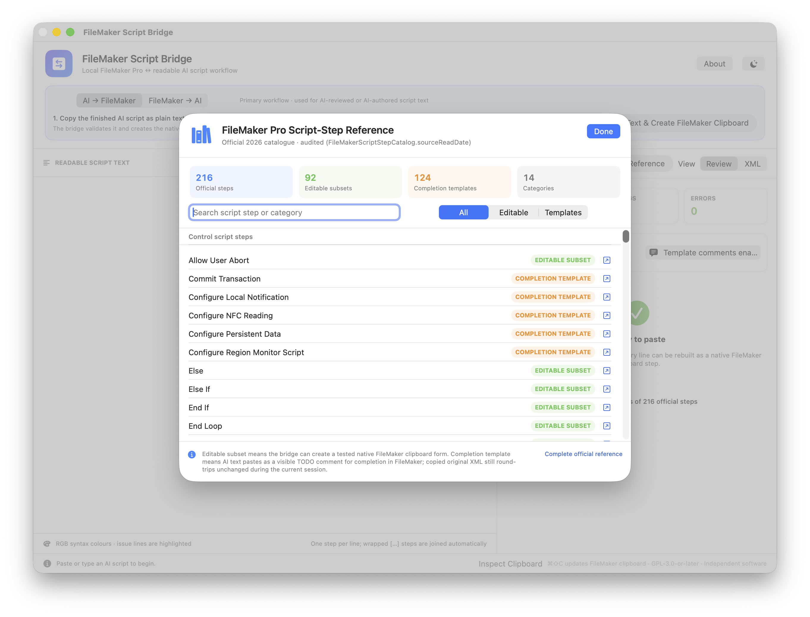

# FileMaker Script Bridge

**Turn AI-generated script text into native FileMaker script steps—without typing every step again.**

ChatGPT, Gemini, and other AI tools can help write or improve a FileMaker script, but their plain-text output cannot be pasted into FileMaker Pro Script Workspace as working steps. FileMaker expects a private, structured clipboard format rather than ordinary text.

FileMaker Script Bridge solves that last-mile problem. It converts readable AI-generated script text into FileMaker's native clipboard representation so you can paste reconstructed steps directly into Script Workspace. It also converts copied FileMaker scripts back into readable text for AI-assisted review. Everything happens locally on your Mac, and you remain in control of what is copied, reviewed, and pasted.



*Paste the finished AI script into the bridge, validate it, then copy the reconstructed native steps into FileMaker Pro.*

[Download the latest macOS release](https://github.com/samuelkcc/filemaker-script-bridge/releases/latest)

## The problem it solves

AI can produce useful FileMaker-style script text, but copying that answer straight into Script Workspace does not create executable FileMaker steps. The usual workaround is to find each step, configure its options, and retype every calculation manually—a slow and error-prone job for a long script.

The bridge connects the two formats:

- readable, line-oriented script text that people and AI assistants can work with;
- FileMaker's native `XMSS` clipboard data for selected script steps; and
- FileMaker's native `XMSC` clipboard data for complete scripts.

The app is deliberately a clipboard bridge, not an AI service or a FileMaker automation tool. It never clicks inside FileMaker and never sends your scripts to ChatGPT, Gemini, or any other service.

## At a glance

```text
ChatGPT / Gemini / editor
           │ copy readable script text
           ▼
 FileMaker Script Bridge
           │ validate + reconstruct native clipboard data
           ▼
 FileMaker Pro Script Workspace
```

## Key features

- Native SwiftUI application for macOS 13 or later.
- Universal Apple Silicon and Intel build (`arm64` + `x86_64`).
- Fully local conversion with no network requests, analytics, or accounts.
- Live syntax colouring, validation, issue highlighting, and XML preview.
- Searchable reference for all 216 official FileMaker Pro 2026 script steps.
- 92 tested editable subsets that can be reconstructed as native FileMaker steps.
- Completion-template comments for the other 124 official steps, keeping the AI's intent visible for manual setup in FileMaker.
- Optional strict native-only mode when the clipboard must contain only tested native steps.
- Lossless same-session preservation for copied FileMaker steps and options that are not yet editable.



*The in-app reference separates tested native support from completion templates. Coverage is expanded by capturing real FileMaker copy-and-paste results, reconstructing the clipboard XML, and verifying that FileMaker accepts it again.*

## How it works

### AI text to FileMaker

1. Ask ChatGPT, Gemini, or another assistant to produce the script as readable FileMaker-style steps, then copy the finished text.
2. In FileMaker Script Bridge, choose **AI → FileMaker** and click **Paste AI Text & Create FileMaker Clipboard**.
3. Review the validation result. Supported lines become native FileMaker steps. In the default template mode, unsupported official steps become clearly marked TODO comments for manual completion.
4. In FileMaker Script Workspace, choose the insertion point and press `⌘V`.

Search Script Workspace for `FileMaker Script Bridge TODO` to find every generated completion template. Replace each comment with the real FileMaker step and configure the options described by the preserved AI text before using the script in production. Choose **Strict native-only** in the bridge if you prefer unsupported AI-authored lines to block clipboard creation instead.

### FileMaker to readable text

1. In FileMaker Script Workspace, select script steps and press `⌘C`. To copy a complete script, select it in the Scripts pane and copy it.
2. In FileMaker Script Bridge, choose **FileMaker → AI** and click **Read FileMaker Clipboard**.
3. The app reads the structured FileMaker payload and replaces the clipboard with readable text.
4. Paste the readable text into your editor or AI assistant.

The required `⌘C` and `⌘V` actions are intentional: the bridge cannot choose a script, insertion point, or destination on your behalf.

## Compatibility and data safety

The in-app reference covers all 216 script steps in the official 2026 Claris FileMaker Pro Help catalogue. Coverage has two distinct AI-to-FileMaker levels:

- **Editable subset:** the documented text form can be parsed and rebuilt as tested native FileMaker clipboard XML. Some steps support only specific, verified option profiles.
- **Completion template:** an AI-authored step that is not yet reconstructable can paste as a visible two-line TODO comment. The comment preserves the requested action for the user to complete manually in FileMaker; it does not perform that action.

For **FileMaker → AI → FileMaker** round trips, the original XML of a copied step that is not yet editable is retained in memory and represented by an `SCKC-P…` preservation marker. If that marker remains unchanged, the original native step can return to FileMaker unchanged during the same app session.

A preservation marker is not portable by itself. Closing the app discards its associated in-memory XML. If a marker is opened in a new session, export is blocked and the original script must be copied from FileMaker again.

Unrecognized or partially supported AI-authored lines have no original XML to preserve. The bridge therefore converts them into visible TODO comments in template mode, or blocks clipboard creation in strict native-only mode, instead of silently dropping or simplifying the requested action. See [Supported Syntax](Documentation/SUPPORTED_SYNTAX.md) and the [Claris coverage index](Documentation/CLARIS_SCRIPT_STEP_COVERAGE.md) for the current boundary.

Private FileMaker clipboard structures can change between releases. This version targets English FileMaker Pro 26 script-step names and does not claim compatibility with future private clipboard formats.

## Install

1. Download `FileMaker Script Bridge.app.zip` from the [latest release](https://github.com/samuelkcc/filemaker-script-bridge/releases/latest).
2. Extract the ZIP and move **FileMaker Script Bridge.app** to Applications.
3. Open the app.

The public build is ad-hoc signed and is not notarized with an Apple Developer ID. macOS may therefore require you to Control-click the app, choose **Open**, and confirm the first launch. Review the source and build locally if your organisation does not permit unnotarized applications.

## Privacy and security

All parsing, validation, and clipboard conversion happens on the Mac. The app does not send scripts anywhere. Content leaves the computer only when the user pastes it into another application or service.

Before sharing a script with any external service, remove or review credentials, personal data, confidential prices, internal hostnames, file paths, account names, and schema details. The [AI review workflow](Documentation/AI_REVIEW_WORKFLOW.md) contains a practical checklist.

## Build and test

Xcode Command Line Tools with Swift 6 are required.

```sh
env \
  CLANG_MODULE_CACHE_PATH="$PWD/.build/SCKCModuleCache" \
  SWIFTPM_MODULECACHE_OVERRIDE="$PWD/.build/SCKCModuleCache" \
  swift test --disable-sandbox --scratch-path "$PWD/.build/sckc-tests"

./Scripts/package-app.sh release
```

The packaging script builds both architectures, combines them with `lipo`, bundles the application icon, applies an ad-hoc signature, verifies a metadata-free staging copy, and creates:

- `dist/FileMaker Script Bridge.app`
- `dist/FileMaker Script Bridge.app.zip`

For redistribution in a managed environment, sign and notarize the app with your own Apple Developer ID.

## Project status

FileMaker Script Bridge is an independent community project under active development. New editable option families are added only after their native FileMaker XML has been captured, round-trip tested, and accepted by FileMaker Script Workspace. Contributions should preserve that evidence-based safety standard.

## Licence

Copyright © 2026 SCKC.

This project is free software licensed under the [GNU General Public License, version 3 or later](LICENSE). It is provided without warranty; see the licence for the complete terms.

## Trademark notice

This is independent software. It is not made by, affiliated with, endorsed by, or supported by Claris International Inc. FileMaker and FileMaker Pro are trademarks of Claris International Inc.

## Support the project ☕

If FileMaker Script Bridge saves you manual typing time, you can support continued development and the careful capture, reconstruction, and FileMaker verification of more native script-step options:

[](https://buymeacoffee.com/samuelchen)
